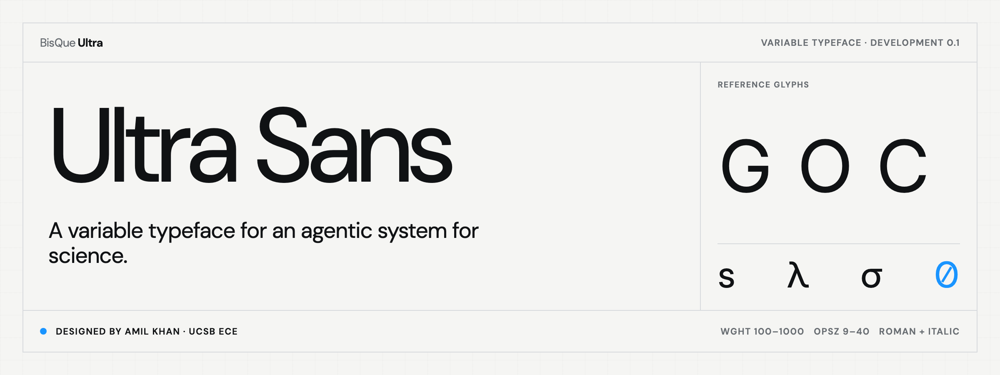

<p align="center">
  <a href="https://amilworks.github.io/ultra-sans/">
    <picture>
      <source media="(prefers-color-scheme: dark)" srcset="docs/assets/ultra-sans-hero-dark.png">
      <source media="(prefers-color-scheme: light)" srcset="docs/assets/ultra-sans-hero-light.png">
      
    </picture>
  </a>
</p>

# Ultra Sans

Ultra Sans is the programmatically drawn typeface for BisQue Ultra. It starts
from DM Sans, then applies measured geometry and OpenType features for dense
scientific interfaces and sustained on-screen reading.

**Designed and authored by [Amil Khan](https://www.amilworks.io)**, a PhD
student in Electrical and Computer Engineering at the University of California,
Santa Barbara, for **Ultra**, an agentic system for science. See the formal
[authorship and citation statement](docs/AUTHORSHIP.md).

[View the live variable specimen →](https://amilworks.github.io/ultra-sans/)

This repository is the font's source of truth. Application CSS, typography
roles, and product integration tests stay in their consuming repositories.

> **Status:** development snapshot. The outlines and artifact hashes are
> reproducible, but the family has not reached a stable public release.

## What is in the current face

- variable roman and italic, `wght` 100–1000 and `opsz` 9–40
- reference-matched `C O G Q Ø` geometry across the full design space
- a narrower, asymmetric lowercase `s` tuned for sentence rhythm at text sizes
- 104 Greek codepoints grafted from Inter and matched at every master
- real tabular figures behind the `tnum` OpenType feature
- a generated slashed zero behind the dormant `zero` feature
- original DM Sans spacing, kerning coverage, vertical metrics, and most outlines

DM Sans Mono informed the small-size `G` clarity check; it is not an outline
donor. This repository currently builds the proportional Ultra Sans family, not
an Ultra Mono family.

## Build and verify

Requirements: `uv` and `curl`.

```bash
uv sync --frozen
make verify
make build
```

`make build` downloads the two pinned DM Sans masters into `.cache/`, verifies
their SHA-256 digests, validates the vendored Inter inputs, rebuilds both WOFF2
files, checks geometry and OpenType invariants, and confirms the committed byte
sizes and digests.

To inspect the type interactively:

```bash
make specimen
```

Then open [http://localhost:5310/](http://localhost:5310/).

To regenerate the exact light and dark README hero exports with an installed
Chromium-family browser:

```bash
make hero
```

Set `ULTRA_SANS_CHROME` to a browser executable when it cannot be discovered
automatically. The renderer verifies the 2400×900 dimensions and records source,
font, export, and browser fingerprints in `docs/assets/readme-hero-manifest.json`.

## Release artifacts

| File | Style | Size | SHA-256 |
| --- | --- | ---: | --- |
| `fonts/UltraSans-Variable.woff2` | Roman | 126,880 bytes | `f060de034541b34034450670bc9becf7c0640f57f2c23dff311ca04a7ff5c97d` |
| `fonts/UltraSans-Italic-Variable.woff2` | Italic | 154,524 bytes | `26470a9271f845356cfd113a15e5df9e623d440bacab5498e45ad16051e5771d` |

Basic web use:

```css
@font-face {
  font-family: "Ultra Sans";
  src: url("./UltraSans-Variable.woff2") format("woff2");
  font-style: normal;
  font-weight: 100 1000;
  font-display: swap;
}

@font-face {
  font-family: "Ultra Sans";
  src: url("./UltraSans-Italic-Variable.woff2") format("woff2");
  font-style: italic;
  font-weight: 100 1000;
  font-display: swap;
}
```

## Repository map

- `font-lab/build_ultra_tabular.py` — adopted, deterministic geometry builder
- `fonts/` — committed release artifacts
- `sources/inter/` — exact Inter 4.1 build inputs
- `index.html` — interactive specimen and GitHub Pages front page
- `docs/assets/` — README hero source, theme exports, and provenance manifest
- `docs/AUTHORSHIP.md` — formal author, affiliation, lineage, and citation record
- `docs/PROVENANCE.md` — source identity, construction, and artifact evidence
- `CITATION.cff` — machine-readable citation metadata
- `font-lab/README.md` — detailed design research and the earlier Inter experiment
- `licenses/` — verbatim upstream SIL Open Font License texts

## License

Ultra Sans is distributed under the SIL Open Font License 1.1. It derives from
DM Sans and incorporates adapted Inter glyphs; both upstream copyright notices
and license texts are preserved under `licenses/`. See [LICENSE.md](LICENSE.md)
and [docs/PROVENANCE.md](docs/PROVENANCE.md) for details.
